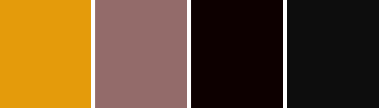

# **The Sweet Vegan**

The Sweet Vegan is an online recipe book for vegan cakes and desserts. The site allows users to register for a free account and share their own recipes.

The site uses HTML5, CSS3, JavaScript, and Python.

The live site can be viewed here:
[The Sweet Vegan](https://mattgriffindev.github.io/ "The Sweet Vegan")

## **1. User experience**

### User stories

**As a first time user, I want to...**

**As a returning user, I want to...**

### Design

**Site structure**

The site consists of X pages.

**Colour scheme**

The color scheme is based on shades of red (copper rose) and orange (gamboge) with shades of grey.

**Typography**

The brand font is Poiret One with a cursive fallback font.

The primary font is Didact Gothic with a sans-serif fallback font.

The signature font is M PLUS 1 Code with a cursive fallback font.

**Imagery**

The hero image is a vegan cake.

The images in the quicklinks section are also vegan cakes.

**Interactive links**

The site includes internal hyperlinks to the different pages of the site and external hyperlinks to Facebook, Twitter and Instagram, which open in a new browser tab.

The site includes two email address hyperlinks that will automatically open a user's email application and autofill the email address in the "To" field, the subject 'Mail from our site' in the "Subject" field, and the text 'Thank you for contacting us. Please let us know how we can help you...' in the body.

**Wireframes**

Wireframes for desktop and mobile views were created using [Balsamiq](https://balsamiq.com/wireframes/ "Balsamiq").

[View the desktop and mobile wireframes here](docs/wireframes/ "Wireframes")

Wireframes were created for desktop and mobile views only. It was considered that this would be sufficient to inform the layout of the tablet view.

Similarly, wireframes were created for the homepage, recipes page, and full recipe page only. It was considered that this would be sufficient to inform the design of other pages.

**Database scheme**

PostgreSQL manages the data for the recipe categories and users.

MongoDB manages the data for the recipes.

## **2. Features**

The site is designed to be responsive on all devices.

## **3. Technologies userd**

**Languages used**

- [HTML5](https://en.wikipedia.org/wiki/HTML5 "HTML5")

- [CSS3](https://en.wikipedia.org/wiki/Cascading_Style_Sheets "CSS3")

- [JavaScript](https://en.wikipedia.org/wiki/JavaScript "JavaScript")

- [Python](https://en.wikipedia.org/wiki/Python_(programming_language) "Python")

**Frameworks, Libraries and Programes Used**

- [Heroku](https://devcenter.heroku.com/) is where the live site is deployed.

- [Bootstrap v5](https://getbootstrap.com/docs/5.0/getting-started/introduction/ "Bootstrap v5") was used to assist with the responsiveness and styling of the website.

- [Cloudinary API](https://cloudinary.com/) was used to enable users to upload images for their recipes whilst keeping the App safe and secure

- [Flask](https://flask.palletsprojects.com/en/2.0.x/) was used to handle the templating for the site.

- [Postgres](https://www.postgresql.org/) was the relational database used to store user registration, login and authentication. Postgres was also used to store the Categories.

- [MongoDB](https://www.mongodb.com/) was the nonrelational database used to store less structured data such as the recipes. MongoDB is where we host our NoSQL database.

- [Flask-PyMongo](https://pypi.org/project/Flask-PyMongo/) provides MongoDB support for Flask applications.

- [pip](https://pip.pypa.io/en/stable/) is the package installer for Python, allowing us to install the packages we need for this site.

- [dnspython](https://www.dnspython.org/) is a DNS toolkit for python.

- [Werkzeug](https://wsgi.readthedocs.io/en/latest/what.html) is a Web Server Gateway Interface web application library.

- [Jinja](https://www.palletsprojects.com/p/jinja/) a templating engine for Python, used to write Flask and other templating services.

- [Google Fonts](https://fonts.google.com/ "Google Fonts") was used to import the Bubblegum Sans and Nunito fonts into the style.css file, which are used throughout the website.

- [Font Awesome](https://fontawesome.com/ "Font Awesome") was used to add icons for aesthetic and UX purposes throughout the website.

- [Hover.css](https://ianlunn.github.io/Hover/ "Hover.css") was used on the links in the navbar to add the underline-from-center transition on hover.

- [jQuery](https://jquery.com/ "jQuery") is included in Boostrap to make the navbar responsive.

- [Git](https://git-scm.com/ "Git") was used for version control by using the Gitpod terminal to commit to Git and push to GitHub.

- [GitHub](https://github.com/ "GitHub") was used to store the project code after being pushed from Git.

- [Balsamiq](https://balsamiq.com/ "Balsamiq") was used to create the wireframes during the design process.

## 4. Testing

**W3C markup validator**

The [W3C Markup Validator](https://validator.w3.org/ "W3C Markup Validator") was used to to validate the site's HTML. The Validator returned no errors or warnings.

A copy of the report can be accessed [here](assets/testing/w3c-html-validator.pdf "W3C Markup Validator report").

**W3C CSS validator**

The [W3C CSS Validator](https://jigsaw.w3.org/css-validator/ "W3C CSS Validator") was used to validate the site's CSS. The Validator returned 2 errors: ‘inherit’ is not a recognised value in the border shorthand property. These errors were resolved by removing the border property as it was deemed unneccsary. The CSS validator returned a large number of warnings related to vendor extensions - these were ignored.

A copy of the original report can be accessed [here](assets/testing/w3c-css-validator-1.pdf "W3C CSS Validator report").

A copy of the final report can be accessed [here](assets/testing/w3c-css-validator-2.pdf "W3C CSS Validator report").

**Lighthouse etsting**

The website was tested using Lighthouse on the Chrome and Microsoft Edge browsers to determine the website’s performance, accessibility, best practices, and SEO.

In all tests, all measures scored at least 90%.

The reports can be viewed below:

- [Chrome Desktop](assets/testing/chrome-lighthouse-desktop.pdf "Chrome Desktop report")

- [Chrome Mobile](assets/testing/chrome-lighthouse-mobile.pdf "Chrome Mobile report")

- [Edge Desktop](assets/testing/edge-lighthouse-desktop.pdf "Edge Desktop report")

- [Edge Mobile](assets/testing/edge-lighthouse-mobile.pdf "Edge Mobile report")

**a11y color contrast accessibility validator**

The [ally Color Contrast Accessibility Validator](https://color.a11y.com/Contrast/ "ally Color Contrast Accessibility Validator") was used to test for color contrast problems. The Validator retuend 4 problems with contrast color-pairs. These problems were resolved by adjusting the contrast of the font color.

A copy of the original report can be accessed [here](assets/testing/color-contrast-accessibility-validator-1.pdf "ally Color Contrast Accessibility Validator report").

A copy of the final report can be accessed [here](assets/testing/color-contrast-accessibility-validator-2.pdf "ally Color Contrast Accessibility Validator report").

**Known Bugs**

No bugs have been identified.

## 5. Deployment

**Deployment to Heroku**

 Heroku was used to deploy this project. The steps used for deployment to Heroku are as follows:

  1. Sign up and log into heroku.
  2. On the top right hand corner of the heroku website, click new, then create new app.
  3. Name the app, select region, and then click the create app button.
  4. Install postgres under the resources tab.
  5. Insert relevant config vars into heroku, such as IP, PORT SECRET_KEY, DATABAS_URL.
  6. You can click connect to github but this project used the CLI method.
  7. Log into heroku via CLI.
  8. Create a git remote for heroku.
  9. Push all changes to the staging area.
  10. Push to heroku for your app to run and function.

## 6. Credits

**Code**

- [Bootstrap v5](https://getbootstrap.com/docs/5.0/getting-started/introduction/ "Bootstrap v5") was used to assist with the responsiveness and styling of the website.

**Information Sources/Resources**

The following sources were used to provide additional information relating to HTML and CSS:

- [W3C Schools](https://www.w3schools.com/ "W3C Schools") 

- [Stack Overflow](https://stackoverflow.com// "Stack Overflow") 

**Content**

All content was written by the developer 

**Media**

All images were used under Creative Commons where available, or under the provisions for research and private study in section 29 of the Copyright, Designs and Patents Act 1988.
s
All images were converted to .webp using [online-convert](https://www.online-convert.com/ "online-convert").

**Acknowledgements**

Thank you to my mentor, Dario Carrasquel for his helpful feedback, and to tutor support at Code Institute for their support and patience.
